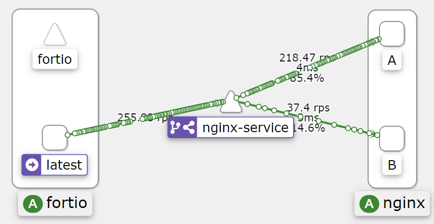

# Intro

Content from Full Cycle course on Istio Service Mash module.
Sample teste with istio using k3d to know how it works.

## Important links

- [k3d](https://k3d.io/)
- [Istio](https://istio.io/)

## Create k8s cluster

```sh
k3d cluster create -p "8000:30000@loadbalancer" --agents 2
```

## Install Istio on cluster

```sh
istioctl install -y
```

## Add istio-injection label to add sidecar proxy to pod

```sh
kubectl label namespace default istio-injection=enabled
```

## Run k8s manifests

```sh
kubectl apply -f .
```

## Istio dashboard addons: Grafana, Jaeger, Kiali and Phometheus

### How to install

```sh
kubectl apply -f https://raw.githubusercontent.com/istio/istio/release-1.18/samples/addons/kiali.yaml && \
kubectl apply -f https://raw.githubusercontent.com/istio/istio/release-1.18/samples/addons/grafana.yaml && \
kubectl apply -f https://raw.githubusercontent.com/istio/istio/release-1.18/samples/addons/jaeger.yaml && \
kubectl apply -f https://raw.githubusercontent.com/istio/istio/release-1.18/samples/addons/prometheus.yaml
```

### How to run

```sh
istioctl dashboard grafana
```

```sh
istioctl dashboard jaeger
```

```sh
istioctl dashboard kiali
```

```sh
istioctl dashboard prometheus
```

## Testing A and B deployments with fortio

### Add, configure and run fortio

```sh
kubectl apply -f https://raw.githubusercontent.com/istio/istio/release-1.18/samples/httpbin/sample-client/fortio-deploy.yaml
```

```sh
export FORTIO_POD=$(kubectl get pods -l app=fortio -o 'jsonpath={.items[0].metadata.name}')
```

```sh
kubectl exec "$FORTIO_POD" -c fortio -- fortio load -c 2 -qps 0 -t 200s -loglevel Warning http://nginx-service:8000
```

## Run Kiali and see traffic graph


